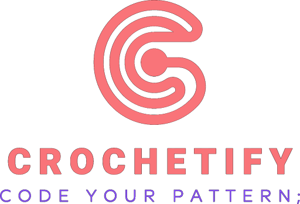

<div align="center">
  
</div>
<br><br>

# Crochetify

Crochetify is a programming language designed to create filet crochet patterns in a simple and structured way. This language allows users to define patterns using a clear and expressive syntax, making it easier to create complex designs for crochet projects.

## Features

- **Structured pattern design**: Define filet crochet patterns using chain (CH), single crochet (SC), and double crochet (DC) symbols.

- **Chart generation**: Convert your patterns into visual charts.

- **Pattern definition**: Define your own patterns to reuse them along your crochet chart. These can also receive arguments and therefore be as personalized as you want. You can also make use of anonymous patterns when you want to reuse a single line with the use of brackets [].

- **Functions**: Build your own crochet chart using predetermined functions such as MIRROR and REPEAT. The former mirrors a single line of crochet as many times you want, while the latter repeats a given pattern any given times.

- **Color design**: Make sure to colorize your pattern and make it unique either by colorizing any row with the use of hexadecimal color values or Color variables.

## Docker Setup Instructions

### 1. Build the Docker Container

- **On Ubuntu/Linux:**
  ```bash
  ./script/ubuntu/docker-build.sh
  ```

- **On Windows:**
  ```bash
  script\windows\docker-build.bat
  ```
### 2. Run docker container

- **On Ubuntu/Linux:**
  ```bash
  ./script/ubuntu/docker-run.sh
  ```

- **On Windows:**
  ```bash
  script\windows\docker-run.bat
  ```
### 3. Install missing libraries

If you run and any libraries are missing make sure to use the following command inside the container:

  ```bash
  script/ubuntu/install.sh
  ```

### 4. Process code

Make sure to have your _.chfy_ file and run the following command:

```bash
  script/ubuntu/start.sh path/to/your/file.chfy [desired_image_name]
  ```

And let the magic happen!

## How to design your crochet

Designing a crochet pattern with **Crochetify** is simple, expressive, and fun! Here are some general guidelines and an example to help you get started:

### General Rules

- **Rows and stitches**: Each row is defined by a sequence of stitches, separated by semicolons (`;`). Supported stitches are:
  - `CH` (chain)
  - `SC` (single crochet)
  - `DC` (double crochet)
- **Turns**: To start a new row, use `TURN` followed by the number of chains needed for the turn (e.g., `TURN CH;`).
- **Colors**: You can assign colors to rows or stitches using hexadecimal codes or color variables.
- **Patterns**: Define reusable patterns with the `Pattern` keyword. Patterns can take parameters (colors, stitches, or even other patterns).
- **Functions**: Use `REPEAT` to repeat a pattern or sequence, and `MIRROR` to mirror a pattern inline.
- **Anonymous patterns**: Use brackets `[]` to define a pattern inline, without naming it.

### Example: Simple Crochet Pattern

```plaintext
Pattern myPattern(Color col, Stitch st){
    CH CH CH;
    TURN CH;
    st st;
    TURN CH CH CH;
    col CH DC CH;
};

Color blue = #0000FF;
Color red = #FF0000;

Pattern myPattern2(){
    SC CH;
    TURN CH CH CH;
    CH DC;
};

BEGIN CROCHET
    myPattern(red, SC);
    TURN CH;
    myPattern2();
END CROCHET
```

## External libraries

- **KHash**: For the symbol table, Crochetify uses of an external library called _klib_, specifically using _khash_. This library can be found in: https://github.com/attractivechaos/klib
